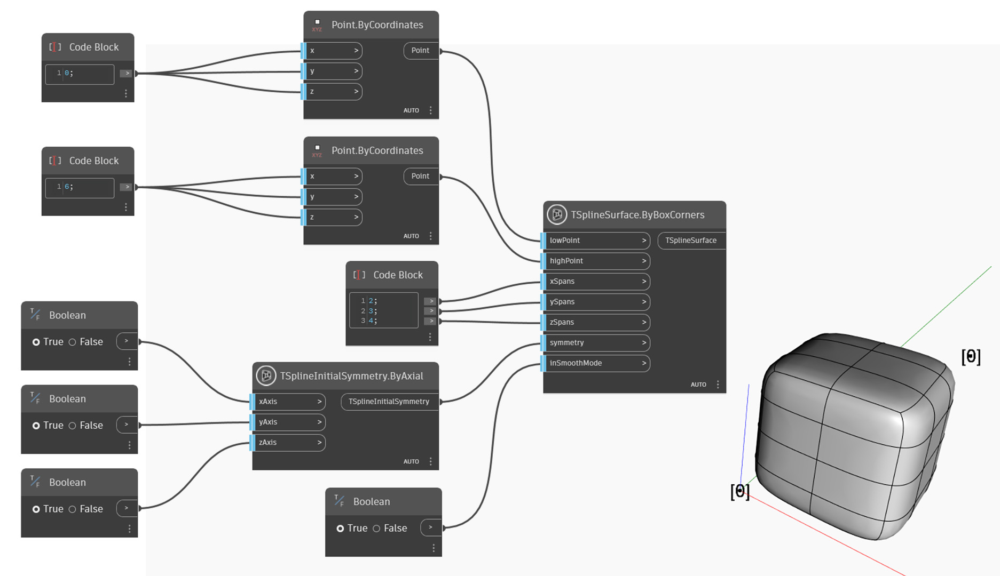

## In-Depth
Uzel `TSplineSurface.ByBoxCorners` vytvoří povrch kvádru T-Spline podle zadaných hodnot vstupů `lowPoint` a `highPoint` a s počtem rozpětí X, Y a Z v každém směru. Možnosti symetrie je možné určit pomocí vstupu `symmetry`. Booleovský vstup`inSmoothMode` přepíná mezi režimem vyhlazení a kvádru.

## Vzorový soubor

