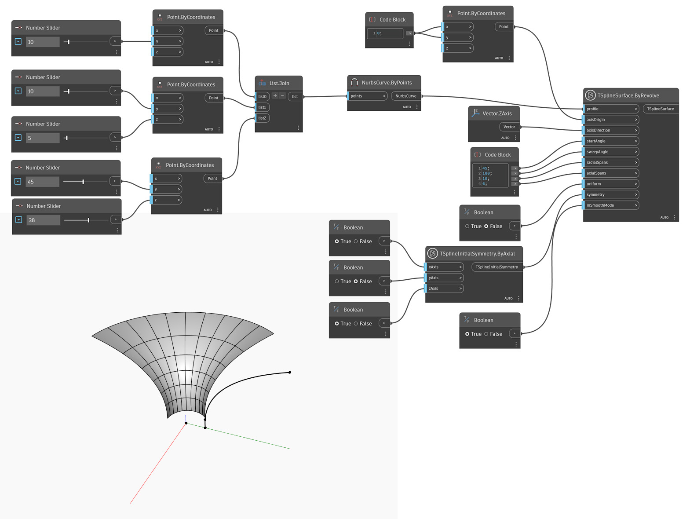

## Podrobnosti
V níže uvedeném příkladu je povrch T-spline vytvořen rotací křivky profilu nastavené vstupem `profile` kolem počátku ve vstupu `axisOrigin` ve směru daném vstupem `axisDirection`. Rozsah rotace je řízen hodnotami `startAngle` a `sweepAngle`. Definice je nastavena hodnotami `radialSpans` a `axialSpans`. Vstup `uniform` určuje, zda jsou rozpětí podél profilu rovnoměrně rozmístěna nebo zda je zohledněno zakřivení. Počáteční symetrie tvaru je určena vstupem `symmetry`. Nakonec se pomocí vstupu `inSmoothMode` přepne mezi náhledem režimu vyhlazení a režimu kvádru povrchu T-Spline.

## Vzorový soubor

