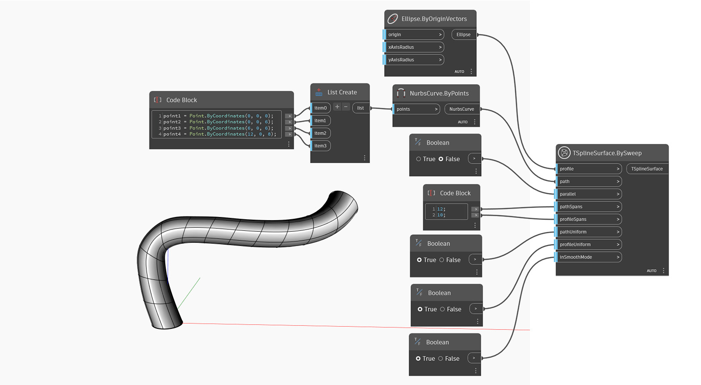

## Podrobnosti
V níže uvedeném příkladu je povrch T-spline vytvořen tažením profilu ve vstupu`profile` kolem dané trajektorie ve vstupu`path`. Vstup `parallel` určuje, zda rozpětí profilu zůstanou rovnoběžná se směrem trajektorie nebo se podél něj otáčí. Definice tvaru je nastavena vstupy `pathSpans` a `radialSpans`. Vstup `pathUniform` definuje, zda jsou rozpětí trajektorie rovnoměrně rozmístěna nebo zda se bere v potaz zakřivení. Podobné nastavení, `profileUniform`, řídí rozpětí podél profilu. Počáteční symetrie tvaru je určena vstupem `symmetry`. Nakonec vstup `inSmoothMode` slouží k přepnutí mezi náhledem v režimu vyhlazení a v režimu kvádru povrchu T-Spline.

## Vzorový soubor

