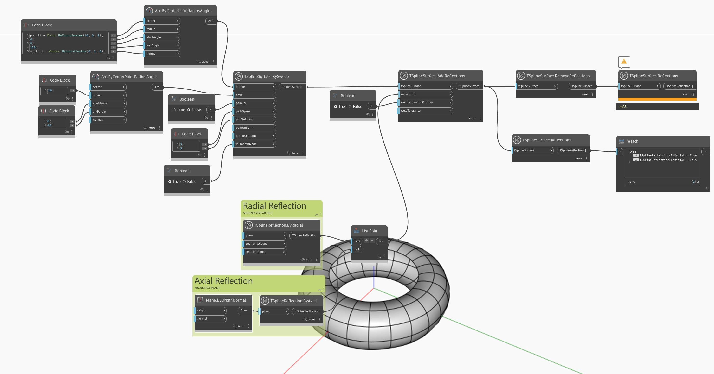

## Podrobnosti
V níže uvedeném příkladu je povrch T-Spline s přidanými odrazy prozkoumán pomocí uzlu `TSplineSurface.Reflections`, který vrací seznam všech odrazů použitých na povrch. Výsledkem je seznam dvou odrazů. Stejný povrch je poté předán prostřednictvím uzlu `TSplineSurface.RemoveReflections` a znovu zkontrolován. Tentokrát uzel `TSplineSurface.Reflections` vrátí chybu, protože byly odebrány odrazy.
___
## Vzorový soubor

