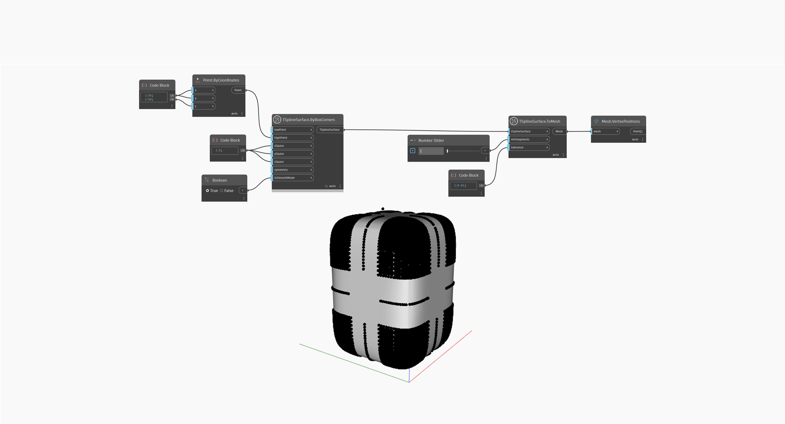

## Podrobnosti
V níže uvedeném příkladu je jednoduchý povrch kvádru T-Spline transformován na síť pomocí uzlu `TSplineSurface.ToMesh`. Vstup `minSegments` definuje minimální počet segmentů plochy v každém směru a je důležitý pro řízení definice sítě. Vstup `tolerance` opraví nepřesnosti přidáním dalších pozic vrcholů, které odpovídají původnímu povrchu v rámci dané tolerance. Výsledkem je síť, jejíž definice je zobrazena v náhledu pomocí uzlu `Mesh.VertexPositions`.
Výstupní síť může obsahovat trojúhelníky i čtyřúhelníky, což je důležité mít na paměti při použití uzlů sady MeshToolkit.
___
## Vzorový soubor

