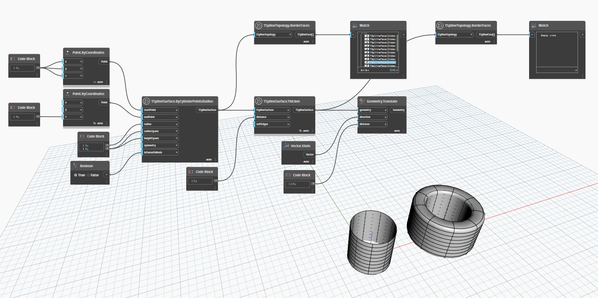

## Podrobnosti
Uzel `TSplineTopology.BorderFaces` vrací seznam hraničních ploch obsažených v povrchu T-Spline.

V níže uvedeném příkladu jsou dva povrchy T-Spline vytvořeny pomocí uzlu `TSplineSurface.ByCylinderPointsRadius`. Jeden je otevřený povrch, zatímco druhý je zesílen pomocí uzlu `TSplineSurface.Thicken`, což jej změní na uzavřený povrch. Jakmile jsou oba povrchy prozkoumány pomocí uzlu `TSplineTopology.BorderFaces`, první vrací seznam okrajových ploch, zatímco druhý vrací prázdný seznam. To proto, že vzhledem k tomu, že je povrch uzavřený, neexistují žádné okrajové plochy.
___
## Vzorový soubor

