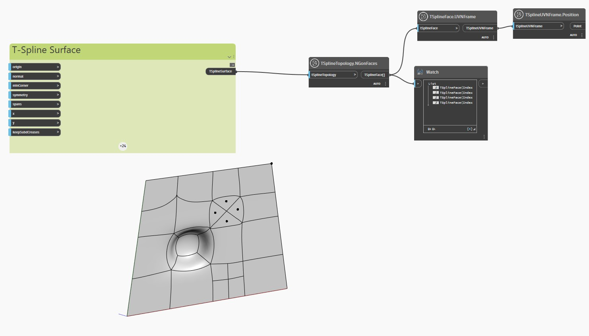

## Podrobnosti
V níže uvedeném příkladu je rovinný povrch T-Spline s vysunutými, dále rozdělenými a taženými vrcholy a plochami zkontrolován pomocí uzlu `TSplineTopology.NGonFaces`.

Uzly `TSplineFace.UVNFrame` a `TSplineUVNFrame.Position` slouží ke zvýraznění středu ploch Ngon povrchu.
___
## Vzorový soubor

