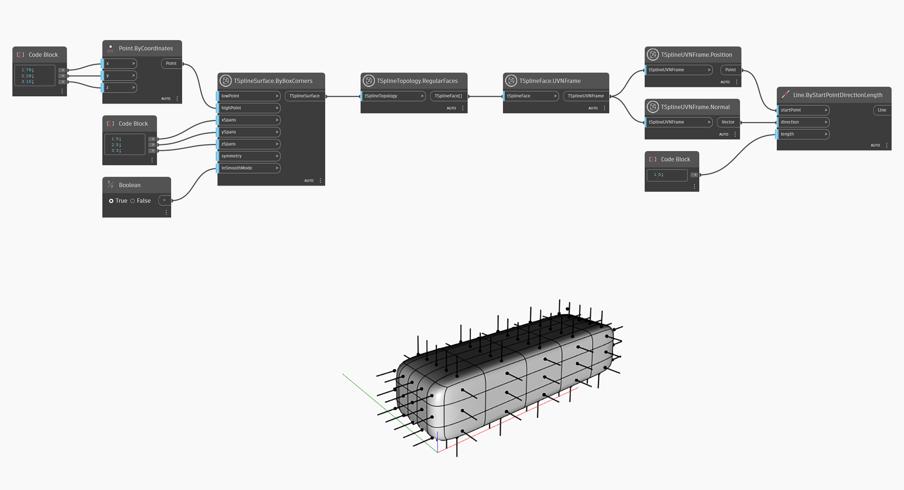

## In-Depth
Uzel `TSplineUVNFrame.Position' vrací pozici rámové konstrukce UVN jako objektu bodu. Pomocí tohoto uzlu je možné vizualizovat pozici vrcholu nebo plochy povrchu při výběru těchto prvků podle indexu.
V níže uvedeném příkladu se tento uzel použije k vizualizaci směru každé běžné plochy na povrchu.

## Vzorový soubor

