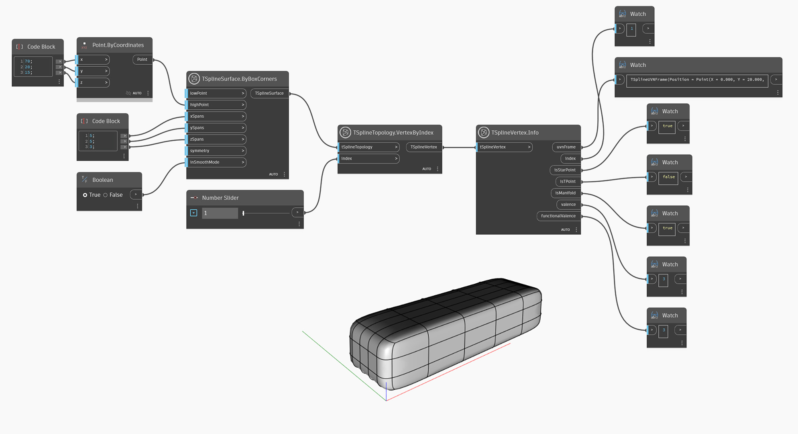

## In-Depth
Uzel `TSplineVertex.Info` vrací následující vlastnosti vrcholu T-Spline:
- `uvnFrame`: bod na trupu, vektor U, vektor V a normálový vektor vrcholu T-Spline
- `index`: index vybraného vrcholu na povrchu T-Spline
- `isStarPoint`: určuje, zda je vybraný vrchol cípem hvězdy
- `isTpoint`: určuje, zda je vybraný vrchol bodem T
- `isManifold`: určuje, zda je vybraný vrchol rozložený
- `valence`: počet hran na vybraném vrcholu T-Spline
- `functionalValence`: funkční valence vrcholu. Další informace naleznete v dokumentaci k uzlu `TSplineVertex.FunctionalValence`.

V níže uvedeném příkladu se pomocí uzlů `TSplineSurface.ByBoxCorners` a `TSplineTopology.VertexByIndex` vytvoří povrch T-Spline a vyberou se jeho vrcholy. Pomocí uzlu `TSplineVertex.Info` se získají výše uvedené informace o vybraném vrcholu.

## Vzorový soubor

