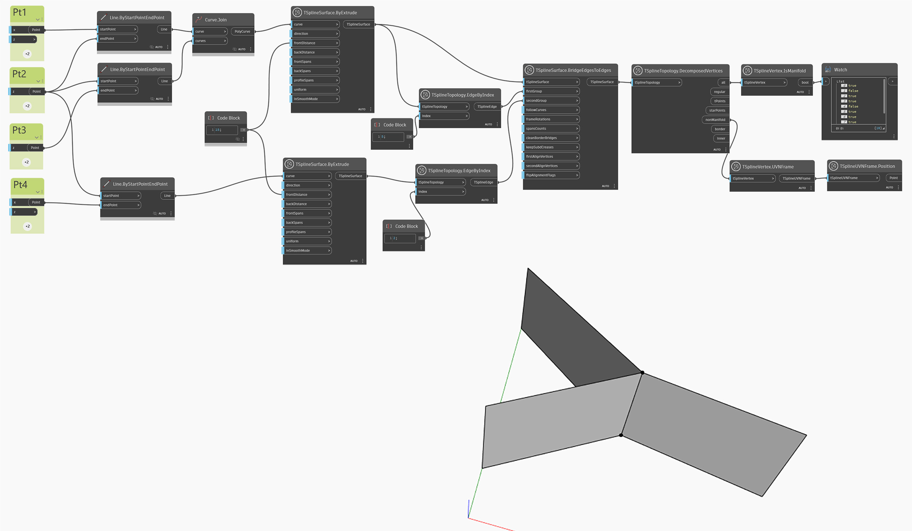

## In-Depth
V níže uvedeném příkladu je nerozložený povrch vytvořen spojením dvou povrchů, které sdílejí vnitřní hranu. Výsledkem je povrch, který nemá jasnou přední a zadní část. Nerozložený povrch je možné zobrazit pouze v režimu kvádru, dokud není opraven. Pomocí uzlu `TSplineTopology.DecomposedVertices` se vytvoří dotaz na všechny vrcholy povrchu a pomocí uzlu `TSplineVertex.IsManifold` se zvýrazní ty vrcholy, které jsou považovány za rozložené. Nerozložené vrcholy jsou extrahovány a jejich pozice je vizualizována pomocí uzlů `TSplineVertex.UVNFrame` a `TSplineUVNFrame.Position`.

## Vzorový soubor

