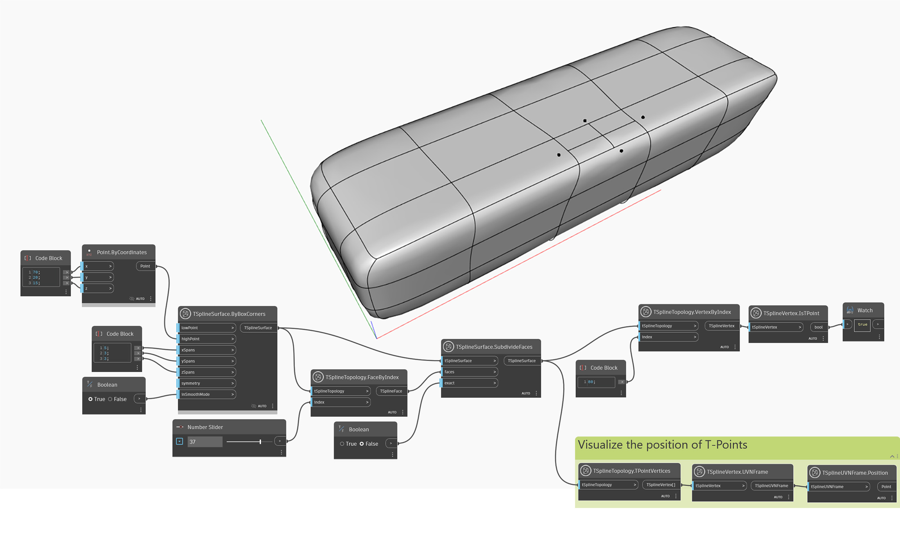

## In-Depth
Uzel `TSplineVertex.IsTPoint` vrací hodnotu, která určuje, zda je vrchol bodem T. Body T jsou vrcholy na konci částečných řádků řídicích bodů.

V níže uvedeném příkladu je u základního kvádru T-Spline pomocí uzlu `TSplineSurface.SubdivideFaces` znázorněn jeden z více způsobů přidání budů T do povrchu. Pomocí uzlu `TSplineVertex.IsTPoint` se potvrdí, že vrchol na určitém indexu je bod T. K lepší vizualizaci pozice bodů T se použijí uzly `TSplineVertex.UVNFrame` a `TSplineUVNFrame.Position`.

## Vzorový soubor

