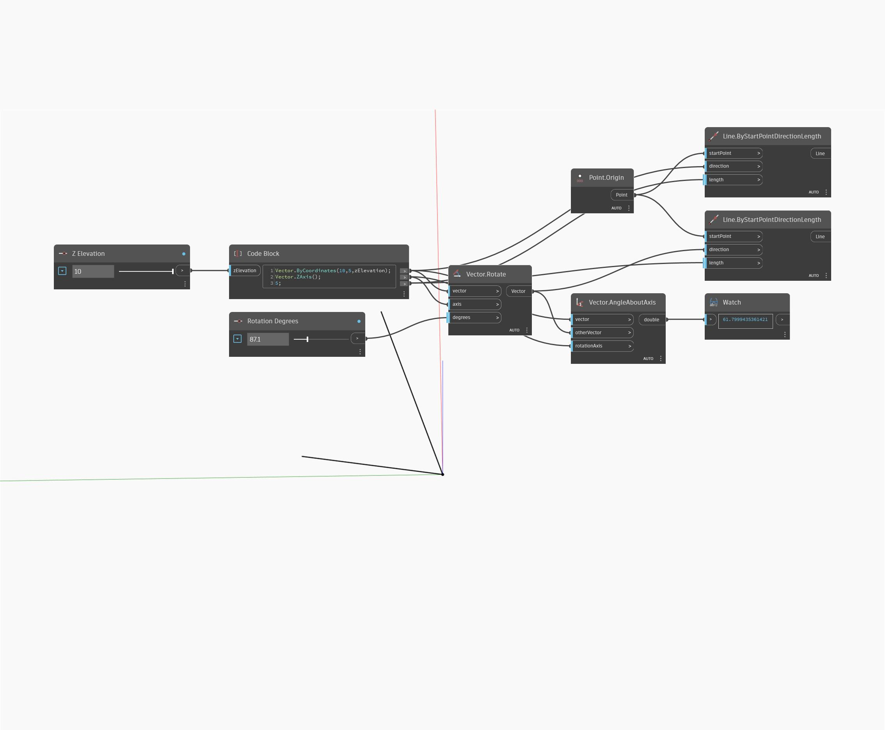

## Podrobnosti
Uzel AngleAboutAxis vrátí měření úhlu mezi dvěma vektory ve stupních od 0 do 360 a kolem osy otáčení. V níže uvedeném příkladu je úhel mezi dvěma vektory měřen kolem osy Z. Úpravou posuvníků Výška Z a Stupně otočení je možné zobrazit, jak tyto změny ovlivňují výsledné měření úhlů. Vektory jsou znázorněny jako čáry.
___
## Vzorový soubor

