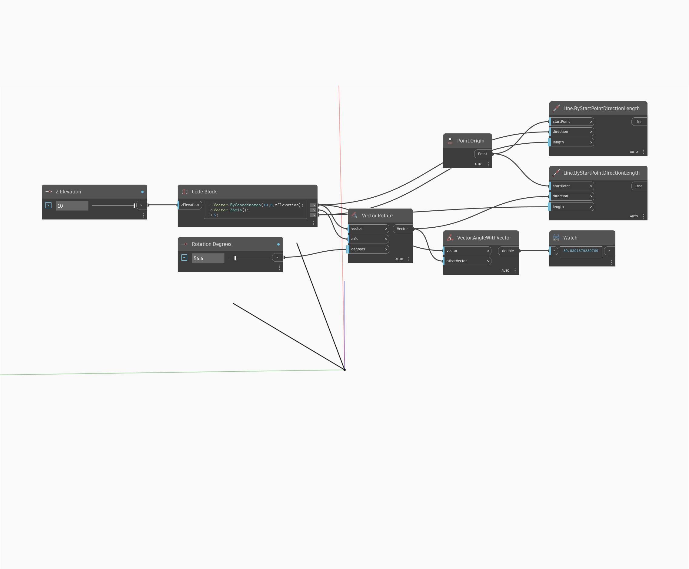

## Podrobnosti
Uzel AngleWithVector vrátí měření úhlu mezi dvěma vektory ve stupních od 0 do 180. V níže uvedeném příkladu je vráceno měření úhlu u dvou vektorů. Úpravou posuvníků Výška Z a Stupně otočení je možné zobrazit, jak tyto změny ovlivňují výsledné měření úhlů. Vektory jsou znázorněny jako čáry.
___
## Vzorový soubor

