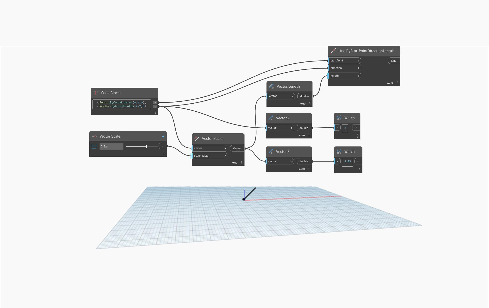

## Podrobnosti
Uzel `Vector.Z` vrací hodnotu typu double představující hodnotu souřadnice Z referenčního bodu.

V následujícím příkladu se pomocí dvou uzlů `Vector.Z` porovnají hodnoty souřadnic Z původního vektoru a vektoru s měřítkem.

___
## Vzorový soubor

