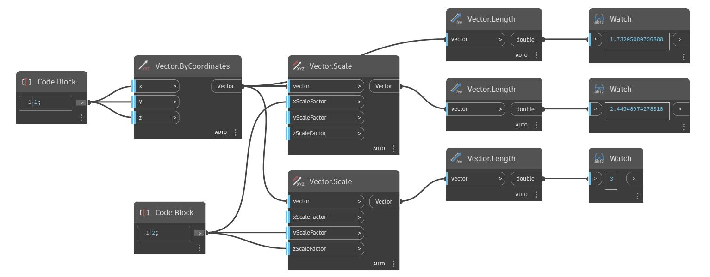

<!--- Autodesk.DesignScript.Geometry.Vector.Scale(xScaleFactor, yScaleFactor, zScaleFactor) --->
<!--- CCR7BJ5XIJULEXEPYBKPPRN72GCPWJFM6VM5D7WFWVQPPL62SAJQ --->
## Podrobnosti
Upraví měřítko vektoru nerovnoměrně kolem počátku.
___
## Vzorový soubor

