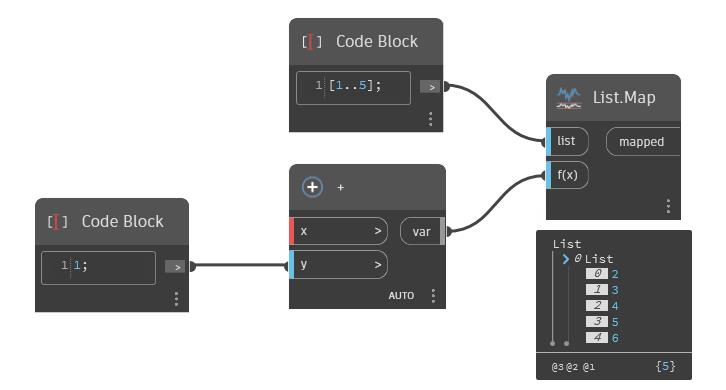

## Podrobnosti
Uzel Map vrátí pozici čísla v rozsahu jako hodnotu typu double. V níže uvedeném příkladu je hodnota 4 namapována na rozsah od 2 do 6. Vzhledem k tomu, že hodnota 4 je v polovině rozsahu od 2 do 6, je vrácena hodnota 0.5.
___
## Vzorový soubor

