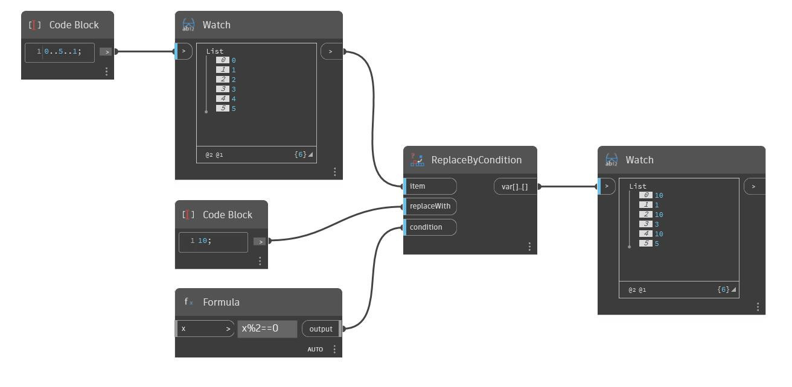

## Podrobnosti
Uzel Replace By Condition přijímá daný seznam a vyhodnotí každou položku s danou podmínkou. Pokud se podmínka vyhodnotí jako 'true', odpovídající položka bude ve výstupním seznamu nahrazena položkou určenou ve vstupu replaceWith. V následujícím příkladu použijeme uzel Formula a zadáme vzorec x%2==0, který najde zbytek dané položky po dělení číslem 2 a poté zkontroluje, zda je tento zbytek roven nule. Tento vzorec vrací hodnotu 'true' u sudých celých čísel. Všimněte si, že vstup x je ponechán prázdný. Pokud tento vzorec použijete jako podmínku pro uzel ReplaceByCondition, výsledkem bude výstupní seznam, v němž jsou všechna sudá čísla nahrazena určenou položkou, v tomto případě celým číslem 10.
___
## Vzorový soubor

