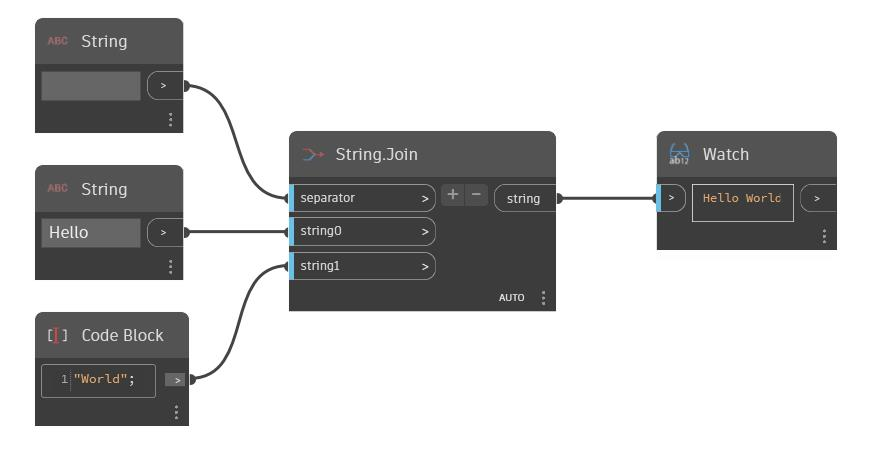

## Podrobnosti
Uzel String umožňuje uživateli zadat hodnotu řetězce. Řetězec je také možné vytvořit pomocí uzlu Code Block, když uzavřete řetězec do uvozovek. V následujícím příkladu vytvoříme pomocí uzlu String a bloku kódu řetězce 'Hello' a 'World'. Pomocí uzlu String.Join je možné sloučit dva řetězce dohromady. Druhý uzel String se použije se znakem mezery, aby mohl sloužit jako oddělovač, výsledkem čehož je výstupní řetězec 'Hello World'.
___
## Vzorový soubor

