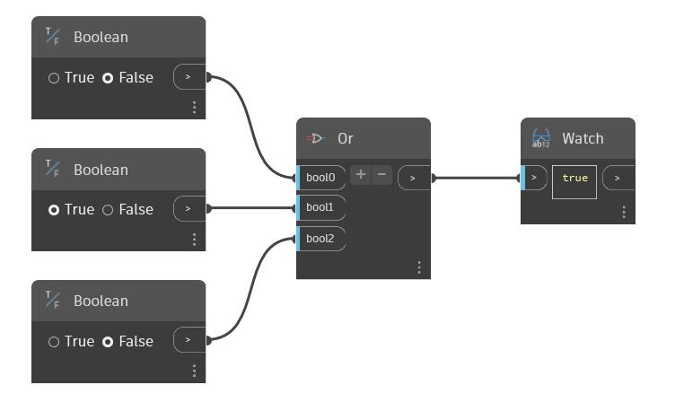

## Podrobnosti
Uzel Or přijímá jako vstup proměnný počet booleovských hodnot. Počet vstupů je možné zvýšit nebo snížit pomocí tlačítek '+' a '-' u uzlu Or. Každý vstup musí být jedna booleovská hodnota. Pokud alespoň jeden vstup má hodnotu true, uzel Or vrací hodnotu 'true', jinak, pokud všechny vstupmy mají hodnotu 'false', uzel vrací hodnotu 'false'. V následujícím příkladu máme k dispozici tři booleovské přepínače, které se použijí jako vstupy uzlu Or. Pokud jsou všechny tři nastaveny na hodnotu 'false', uzel Or vrátí hodnotu 'false'.
___
## Vzorový soubor

