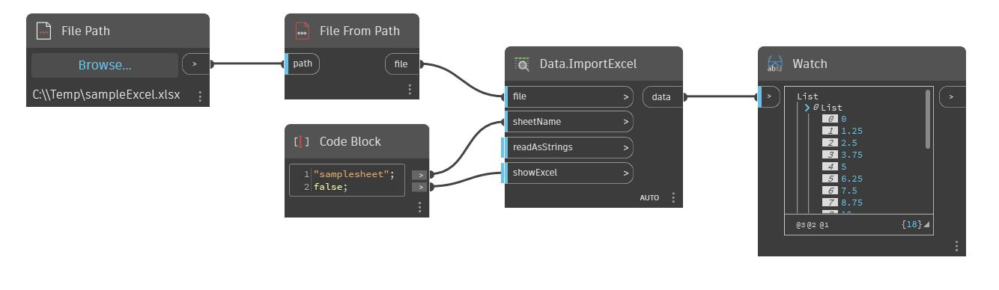

## Podrobnosti
Uzel Watch zobrazí výstup uzlu ve formátu seznamu. V níže uvedeném příkladu je obsah souboru aplikace Excel vrácen jako seznam a zobrazen v uzlu Watch. Uzel Watch je užitečný k pochopení struktur seznamu, typů geometrie atd., které různé uzly vrací.
___
## Vzorový soubor

