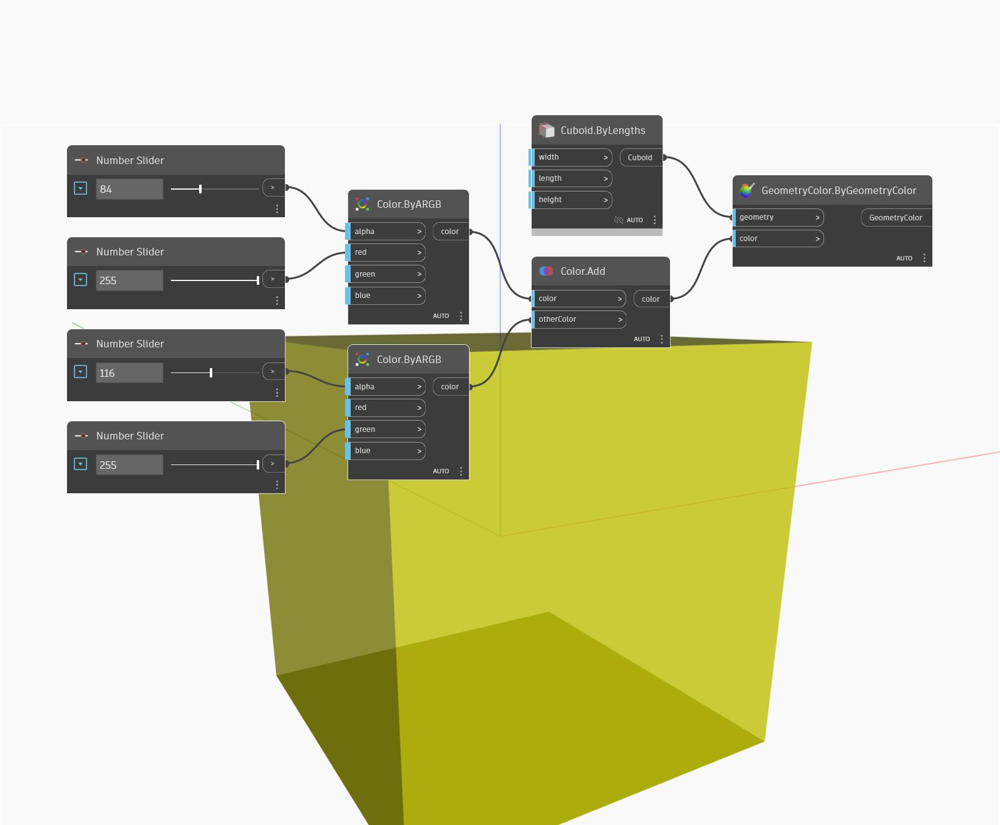

## Podrobnosti
Uzel Add vrátí vektor, který je součtem dvou jiných vektorů. V níže uvedeném příkladu je výsledkem součtu vektoru osy Z GSS a vektoru osy X GSS vektor se souřadnicemi (1,0,1). Nový vektor je reprezentován jako úsečka.
___
## Vzorový soubor

