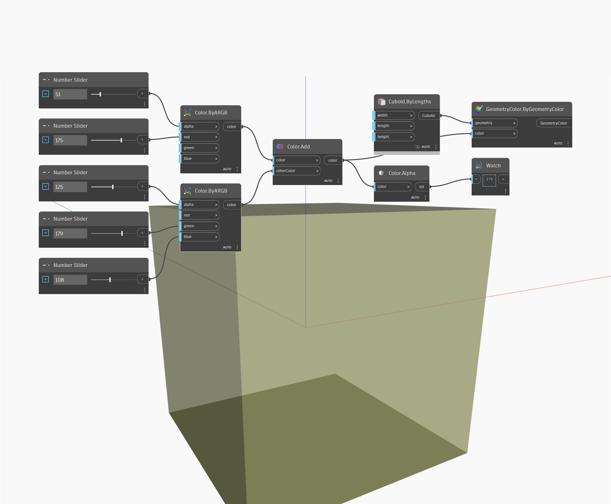

## Podrobnosti
Uzel Alpha vrátí hodnotu alfa vstupní barvy v rozsahu od 0 do 255. V níže uvedeném příkladu vytvoříme dvě barvy pomocí uzlů ByARGB a poté tyto dvě barvy sloučíme dohromady. Pomocí uzlu Alpha bude nalezena hodnota alfa výsledné barvy.
___
## Vzorový soubor

