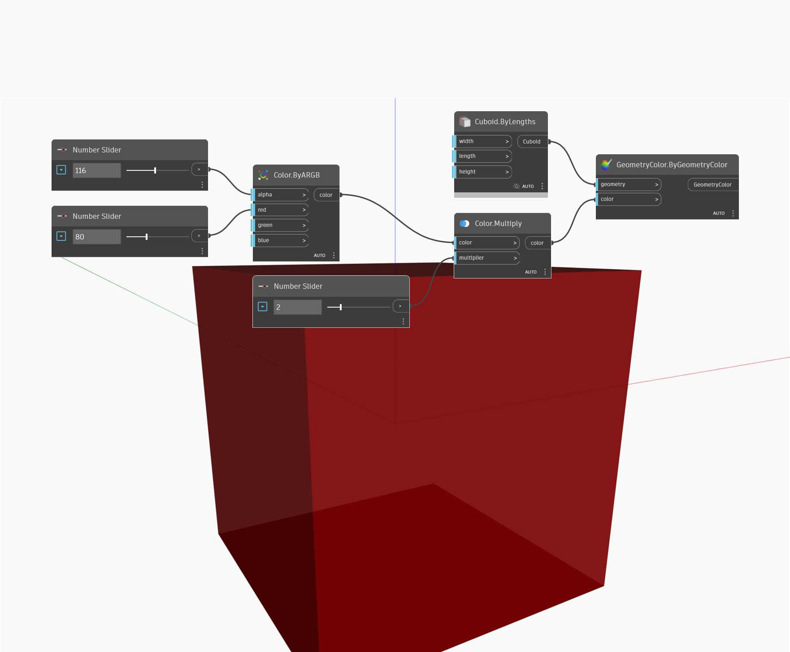

## Podrobnosti
Uzel Multiply vynásobí jednotlivé kanály barvy vstupním číslem a je vrácena výsledná barva. Vezměte na vědomí, že výsledné hodnoty musí být menší než 255. V níže uvedeném příkladu vytvoříme barvu pomocí uzlů ByARGB. Poté pomocí uzlu Multiply vynásobíme barvu číslem řízeným číselným posuvníkem. K vizualizaci výsledné barvy se použije uzel Display.ByGeometryColor společně s výchozím kvádrem.
___
## Vzorový soubor

