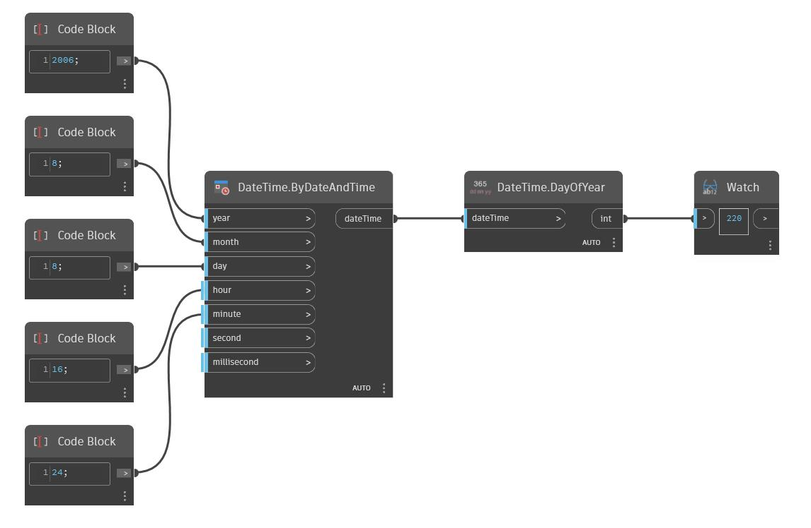

## Podrobnosti
Uzel DayOfYear vrátí den roku z objektu dateTime jako číslo. V níže uvedeném příkladu je z objektu dateTime s hodnotou August 08, 2006 4:24PM vrácen den roku – 220.
___
## Vzorový soubor

