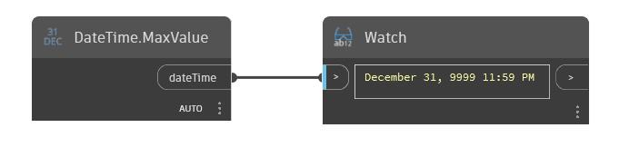

## Podrobnosti
Uzel MaxValue vrátí maximální hodnotu, kterou může objekt TimeSpan mít. V níže uvedeném příkladu je vrácen objekt TimeSpan s hodnotou 10 675 199 dní, 2 hodiny, 28 minut, 5 sekund, 477 milisekund.
___
## Vzorový soubor

