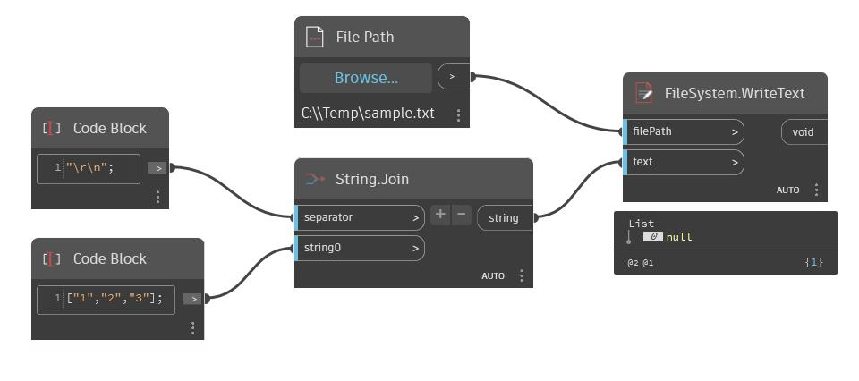

## Podrobnosti
Uzel WriteText zapíše řetězec do určeného souboru. Pokud soubor neexistuje, tento uzel jej vytvoří. Nové řádky ve výstupním souboru můžeme vytvořit pomocí znaku escape '\r\n'. V následujícím příkladu máme seznam řetězců, které chceme zapsat jako tři samostatné řádky v textovém souboru. Seznam spojíme do jednoho řetězce a jako oddělovač použijeme výraz '\r\n'. Poté pomocí uzlu WriteText zapíšeme tento obsah do textového souboru.
___
## Vzorový soubor

