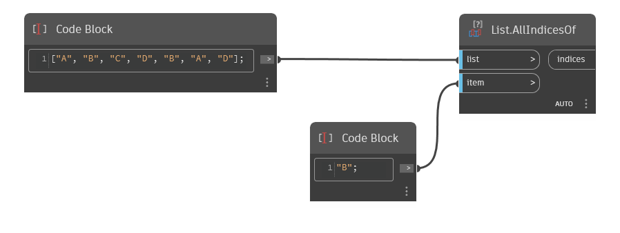

## Podrobnosti
Uzel `List.AllIndicesOf` vyhledá danou položku v daném seznamu a vrátí seznam indexů, na kterých byla nalezena. Pokud není nalezena žádná položka, uzel `List.AllIndicesOf` vrátí prázdný seznam.

V následujícím příkladu nejprve vygenerujeme seznam řetězců a každý z nich obsahuje písmeno mezi písmeny A a D. Poté pomocí uzlu `List.AllIndicesOf` vyhledáme v seznamu řetězec B, který se nachází na indexech 1 a 4.
___
## Vzorový soubor

