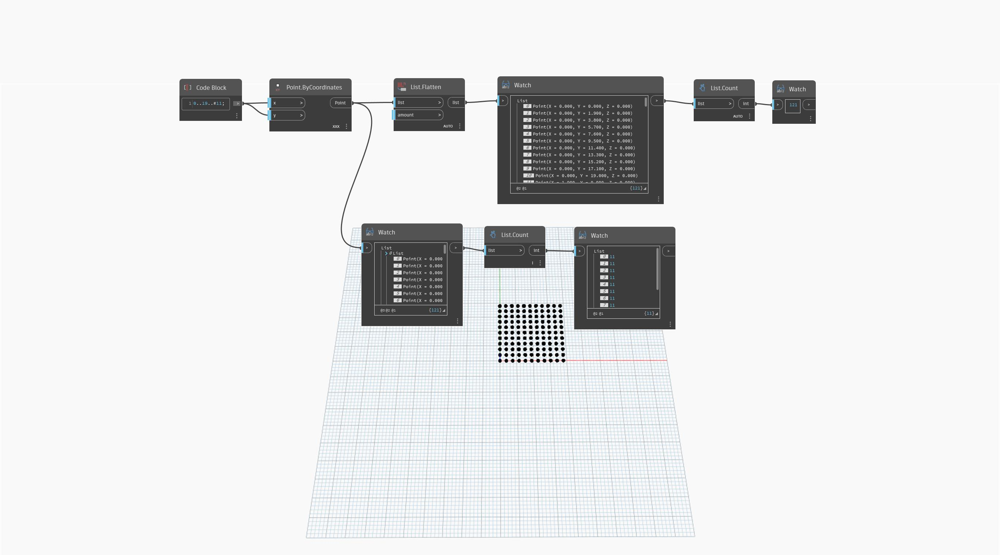

## Podrobnosti
Uzel `List.Count` vrací počet položek ve vstupním seznamu nebo seznamech.

V následujícím příkladu vytvoříme mřížku bodů. Poté porovnáme počet položek v seznamu před jeho vyrovnáním a po něm. Před vyrovnáním uzel `List.Count` vrátí 11 položek (dílčích seznamů) seznamu. Po vyrovnání uzel Count vrátí 121 položek, protože veškeré dílčí seznamy budou odebrány a body jsou nyní na stejné úrovni seznamu.
___
## Vzorový soubor

