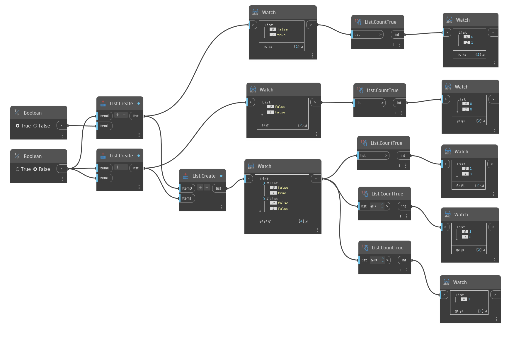

## Podrobnosti
Uzel `List.CountTrue` vrací počet booleovských hodnot True ve stupním seznamu nebo seznamech.

V následujícím příkladu vrátíme pomocí uzlu `List.CountTrue` počet hodnot True v seznamech booleovských hodnot.

___
## Vzorový soubor

