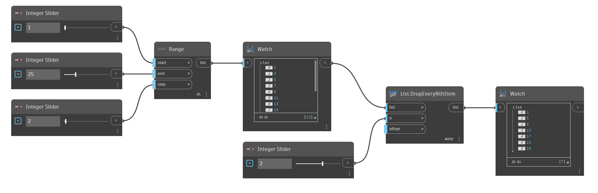

## Podrobnosti
Uzel `List.DropEveryNthItem` odebere položky ze vstupního seznamu v intervalech vstupní hodnoty n. Počáteční bod intervalu je možné změnit vstupem `offset`. Například zadáním hodnoty 3 do n a ponecháním vstupu offset na výchozí hodnotě 0 odstraníte položky s indexy 2, 5, 8 atd. Pomocí vstupu offset 1 odeberete položky s indexy 0, 3, 6 atd. Berte na vědomí, že se hodnota vstupu offset „zalamuje“ v rámci celého seznamu. Chcete-li místo odebrání zachovat vybrané položky, přejděte k uzlu `List.TakeEveryNthItem`.

V následujícím příkladu nejprve vygenerujeme seznam čísel pomocí uzlu `Range` a poté odebereme každé druhé číslo pomocí hodnoty 2 jako vstupu `n`.
___
## Vzorový soubor

