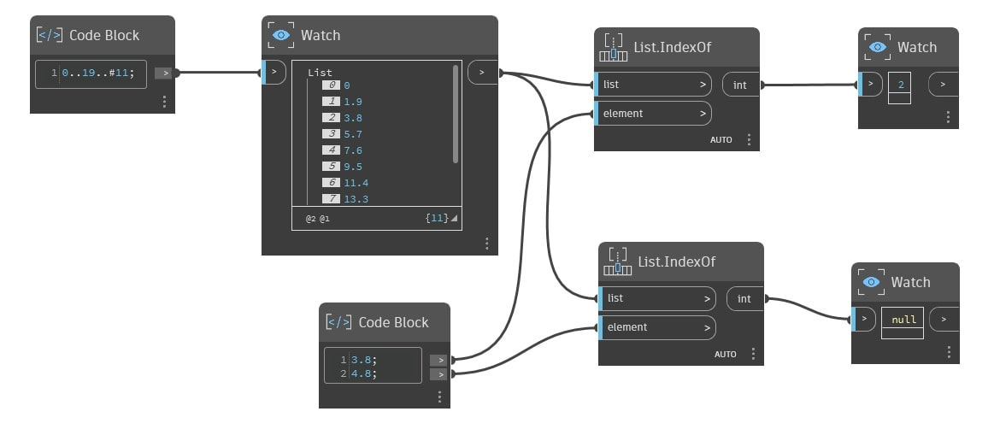

## Podrobnosti
Uzel `List.IndexOf` vrací umístění indexu daného prvku v seznamu. Pokud daný prvek není v seznamu nalezen nebo jeho datový typ neodpovídá prvku seznamu (například vstup je typu double a prvek seznamu je typu string), uzel `List.IndexOf` vrátí hodnotu null.

Berte na vědomí, že tento uzel vrací pouze první index, i když se prvek v seznamu zobrazuje vícekrát. Chcete-li vrátit více indexů, použijte místo toho uzel `List.AllIndicesOf`.
___
## Vzorový soubor

