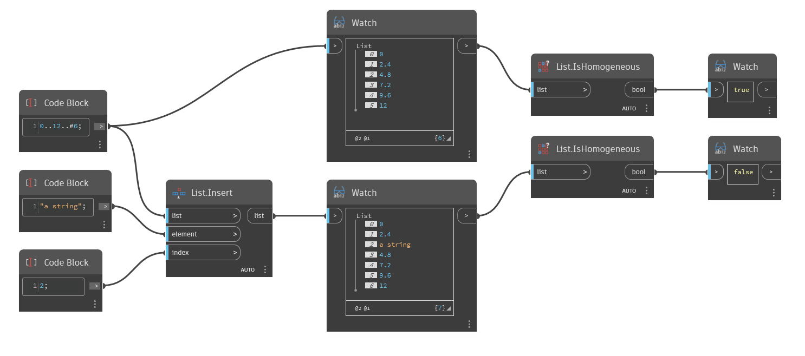

## Podrobnosti
Uzel `List.IsHomogenous` vrací booleovskou hodnotu podle toho, zda jsou všechny prvky v seznamu stejného typu.

V následujícím příkladu je jednoduchý seznam čísel porovnán se stejným seznamem s vloženým řetězcem. Původní seznam je homogenní (pouze čísla), takže uzel `List.IsHomogenous` vrátí hodnotu True. Nový seznam není homogenní (čísla a řetězec), takže uzel `List.IsHomogenous` vrátí hodnotu False.
___
## Vzorový soubor

