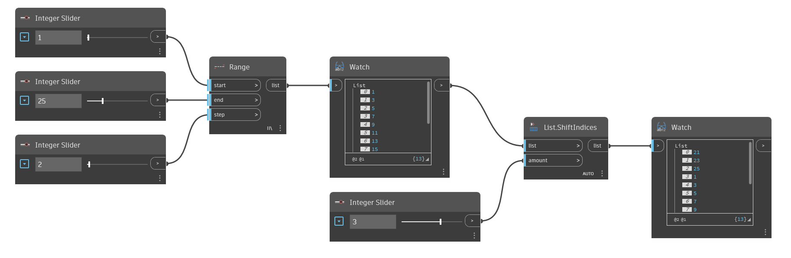

## Podrobnosti
Uzel `List.ShiftIndices` posune pozici položek v seznamu o hodnotu ve vstupu `amount`. Kladné číslo vstupu `amount` posune čísla nahoru, zatímco záporné číslo posune indexy zpět. Položky se přetáčí, což způsobí, že se položky na konci seznamu přesunou na začátek.

V následujícím příkladu nejprve vygenerujeme seznam pomocí uzlu `Range` a poté posuneme indexy vpřed o 3. Konečná 3 čísla z původního seznamu se přetočí, aby se stala prvními 3 čísly v novém seznamu.
___
## Vzorový soubor

