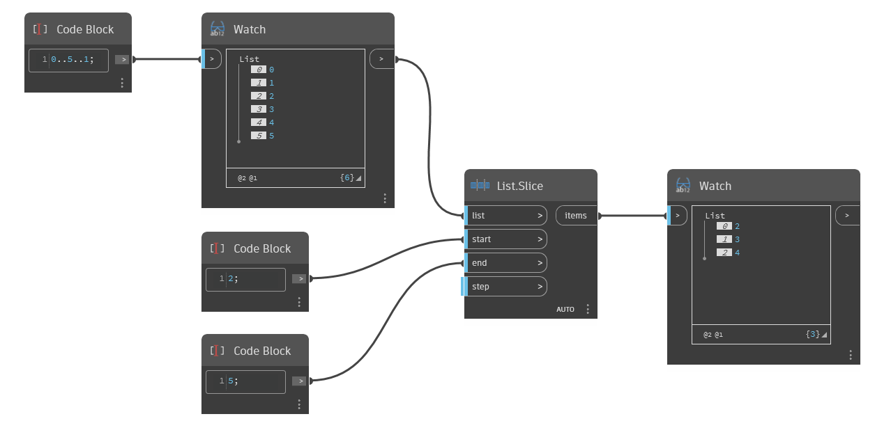

## Podrobnosti
Uzel `List.Slice` vrací dílčí seznam ze vstupního seznamu podle zadaného začátku, konce a kroku. Vstup `start` určuje počáteční index výstupního seznamu. Vstup `end` určuje jeho koncový index. Tento index není zahrnut ve výstupním seznamu. Vstup `step` určuje počet indexů oddělujících položky seznamu. Ve výchozím nastavení je to 1.

V následujícím příkladu je výsledkem použití počátečního indexu 2 a koncového indexu 5 nový seznam, který se skládá z položek s indexy 2, 3 a 4 z původního seznamu.
___
## Vzorový soubor

