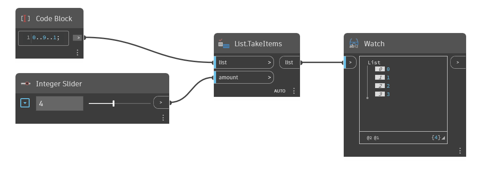

## Podrobnosti
Uzel `List.TakeItems` vrací zadaný počet položek od začátku vstupního seznamu. Pokud je vstup `amount` záporný, položky jsou načteny z konce seznamu v obráceném pořadí.

V následujícím příkladu začneme s rozsahem čísel od 0 do 9 s krokem 1. Na vstupu `amount` určíme pomocí posuvníku celých čísel počet prvků, které mají být načteny z původního seznamu. Se vstupem 4 obsahuje výstupní seznam první 4 prvky z původního seznamu.
___
## Vzorový soubor

