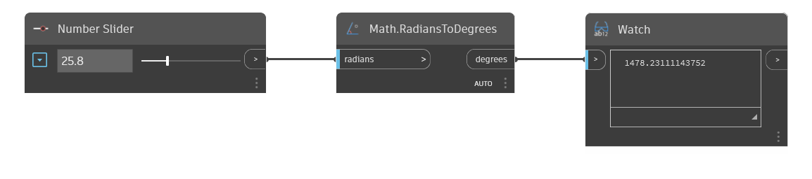

## Podrobnosti
Uzel Math.RadiansToDegrees převede vstupní úhel z radiánů na stupně. V níže uvedeném příkladu je možné pomocí číselného posuvníku řídit vstupní úhel pro uzel RadiansToDegrees.
___
## Vzorový soubor

