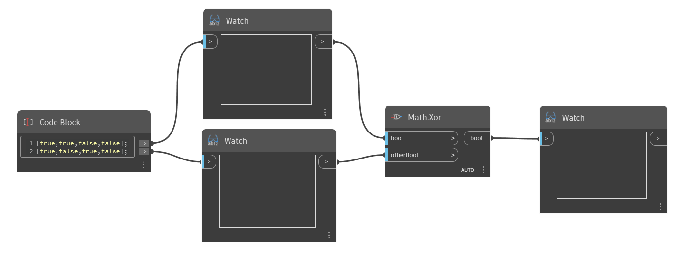

## Podrobnosti
Uzel `Math.Xor` přijímá dvě booleovské hodnoty nebo dva seznamy booleovských hodnot a určí, zda jsou hodnoty stejné nebo rozdílné. Uzel `Math.Xor` porovná vstupní hodnoty a vrací hodnotu True, pokud právě jeden ze vstupů má hodnotu True. Pokud jsou obě hodnoty True nebo pokud jsou obě hodnoty False, uzel `Math.Xor` vrací hodnotu False.

V níže uvedeném příkladu začneme s dvěma seznamy booleovských hodnot. Dohromady tyto seznamy představují čtyři možné kombinace hodnot True a False. Všimněte si, že na rozdíl od uzlů `And` a `Or` uzel `Math.Xor` povoluje pouze dvě hodnoty.
___
## Vzorový soubor

