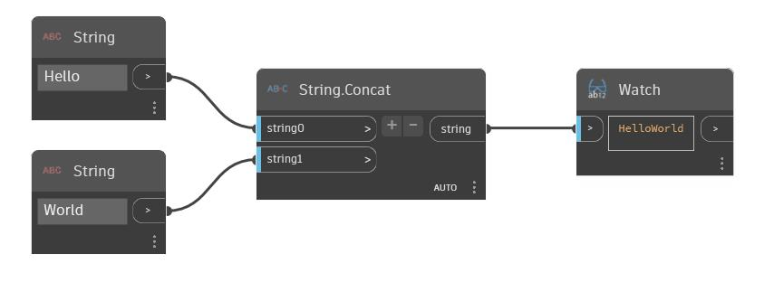

## Podrobnosti
Uzel Concat zřetězí více řetězců do jednoho řetězce. Počet vstupních řetězců je možné změnit pomocí tlačítek '+' a '-' u uzlu Concat. V následujícím příkladu začínáme dvěma samostatnými řetězci 'Hello' a 'World'. Pomocí uzlu Concat budou zřetězeny dohromady a vznikne řetězec 'HelloWorld'.
___
## Vzorový soubor

