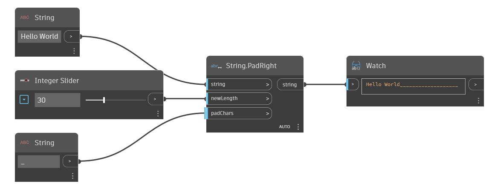

## Podrobnosti
Uzel PadRight zvětší šířku vstupního řetězce podle vstupu newWidth přidáním vstupu padChars na pravou stranu původního řetězce. Pokud je původní řetězec delší než hodnota vstupu newWidth, tento uzel vrátí původní řetězec beze změny. V následujícím příkladu použijeme jako vstupní řetězec 'Hello World'. Jako vyplňující znak se použije řetězec se znakem podtržítka, zatímco nová šířka řetězce je řízena pomocí celočíselného posuvníku.
___
## Vzorový soubor

