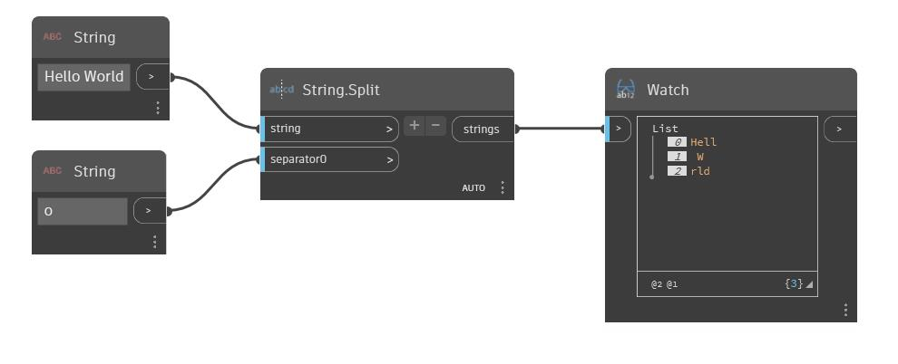

## Podrobnosti
Uzel Geometry Split funguje podobně jako uzel Geometry Trim. Přijímá na vstupu nástroj – libovolný typ geometrie, pomocí kterého oříznete jinou geometrii – a geometrii a vrátí všechny fragmenty geometrie. V tomto příkladu je kužel rozdělen jiným podobným kuželem. Přestože uzel Geometry Split vrátí všechny fragmenty, v ukázkovém souboru je zobrazen náhled jednoho z nich.
___
## Vzorový soubor

