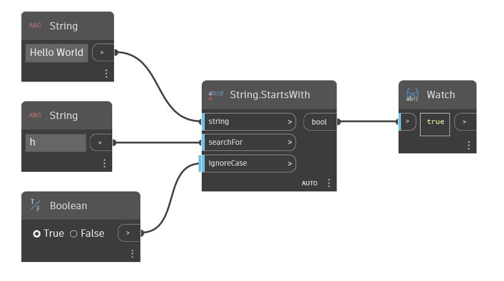

## Podrobnosti
Uzel Starts With vrátí booleovskou hodnotu podle toho, zda daný řetězec začíná druhým vstupním řetězcem. Ve výchozím nastavení tento uzel rozlišuje malá a velká písmena. Pomocí booleovské hodnoty ve vstupu 'ignoreCase' je možné nastavit uzel tak, aby velikost písmen v řetězcích nerozlišoval. V následujícím příkladu použijeme řetězec 'Hello World' jako původní řetězec a také použijeme druhý řetězec 'h' jako hledaný řetězec. Vzhledem k tomu, že řetězec 'Hello World' začíná řetězcem 'h' a vstup ignoreCase je nastaven na hodnotu true, uzel StartsWith vrátí hodnotu true.
___
## Vzorový soubor

