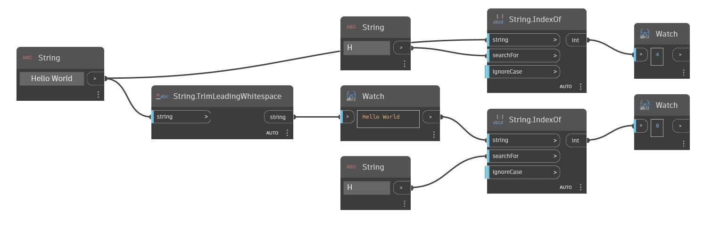

## Podrobnosti
Uzel TrimLeadingWhitespace odebere bílé znaky ze začátku vstupního řetězce. V následujícím příkladu začneme řetězcem '     Hello World     ', který má několik úvodních a koncových mezer. Pomocí uzlu TrimLeadingWhitespace můžeme odebrat mezery na začátku řetězce.
___
## Vzorový soubor

