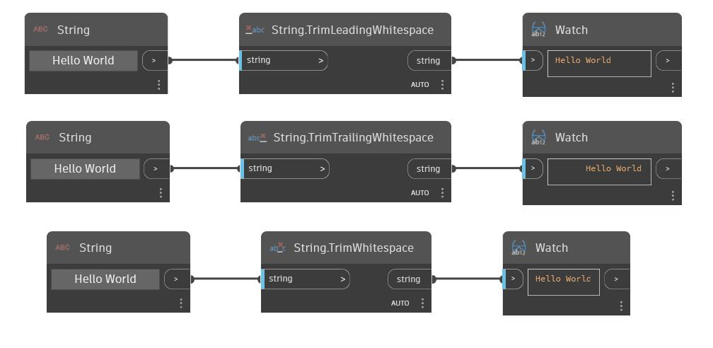

## Podrobnosti
Uzel TrimWhitespace odebere všechny bílé znaky ve vstupním řetězci. V následujícím příkladu začneme řetězcem '     Hello World     ', který má několik úvodních a koncových mezer. Pomocí uzlu TrimWhitespace můžeme odebrat mezery na začátku a na konci řetězce a také mezeru mezi slovy 'Hello' a 'World'.
___
## Vzorový soubor

