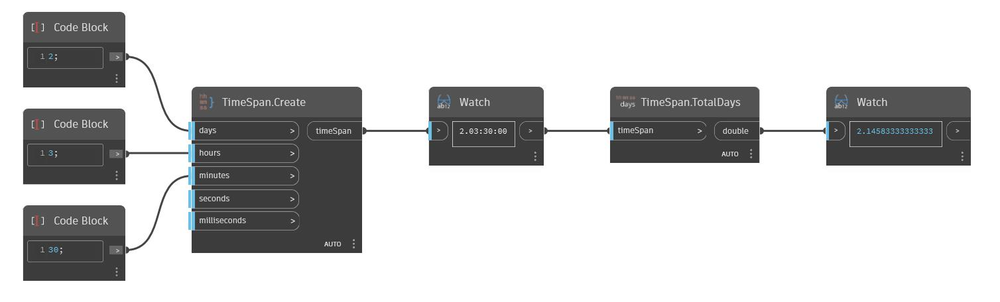

## Podrobnosti
Uzel TotalDays vrátí počet dní v objektu TimeSpan jako hodnotu typu double. V níže uvedeném příkladu je vrácen celkový počet dnů u objektu TimeSpan 2.03:00:00, což je ~2.1458333.
___
## Vzorový soubor

