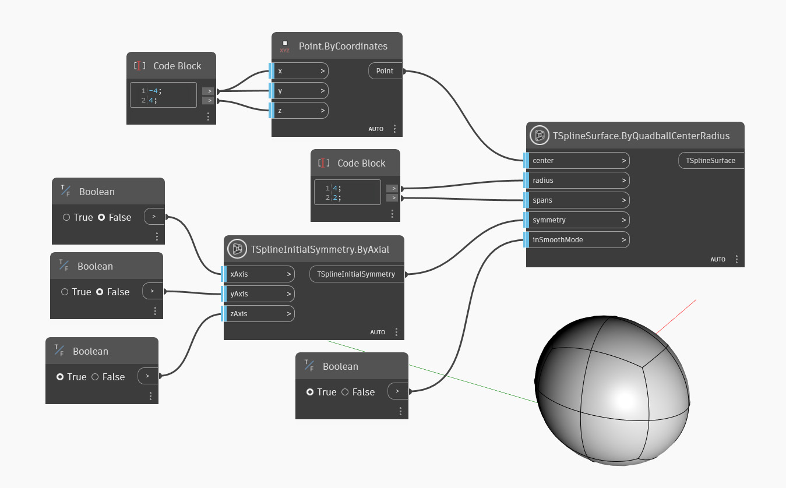

<!--- Autodesk.DesignScript.Geometry.TSpline.TSplineSurface.ByQuadballCenterRadius --->
<!--- E6WVV65M7FG2AAAGG4DXIQJPDKVNYXI5GRVNBAR4TR6T6356R2TQ --->
## In-Depth
V níže uvedeném příkladu se vytvoří základní čtyřúhelníková koule T-Spline, umístěná kolem bodu daného vstupem `center` s daným poloměrem ze vstupu `radius` a rozdělená daným počtem rozpětí ze vstupu `spans`. Počáteční symetrie tvaru je určena vstupem `symmetry`. Nakonec vstup `inSmoothMode` umožní přepínání mezi režimem náhledu vyhlazení a kvádru povrchu T-Spline.

## Vzorový soubor

