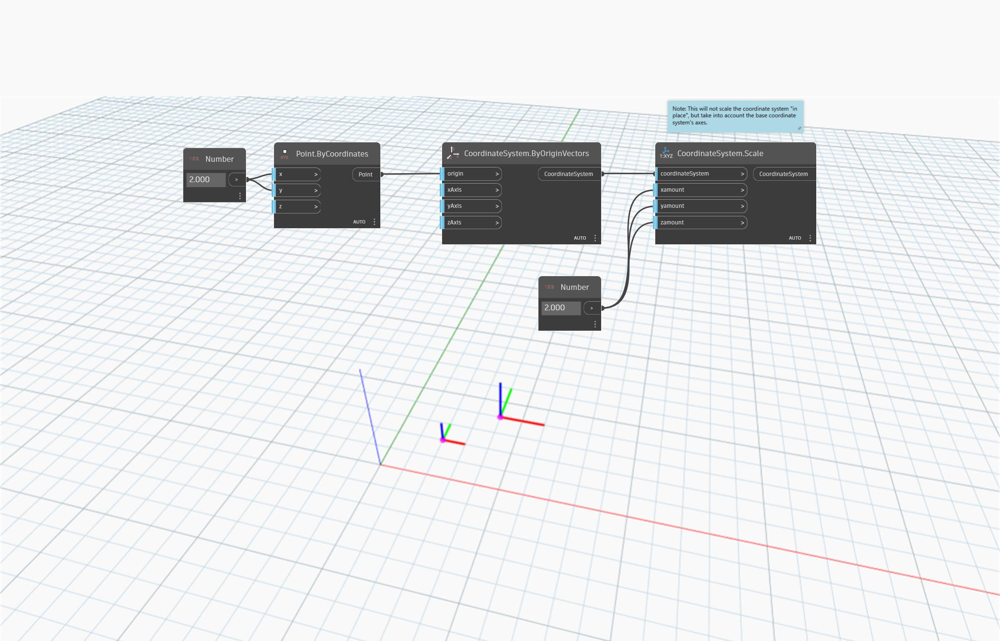

<!--- Autodesk.DesignScript.Geometry.CoordinateSystem.Scale(coordinateSystem, xamount, yamount, zamount) --->
<!--- FPPU5FCLXHQEPRW7XPEABZGTPZWIO4HFADTOKNKVF4776WBW7AMQ --->
## Podrobnosti
Uzel `CoordinateSystem.Scale (coordinateSystem, xamount, yamount, zamount)` změní měřítko souřadnicového systému nerovnoměrně kolem počátku.

V níže uvedeném příkladu se vytvoří souřadnicový systém podle souřadnic bodu a poté se pomocí uzlu `CoordinateSystem.Scale` změní jeho měřítko.
___
## Vzorový soubor

