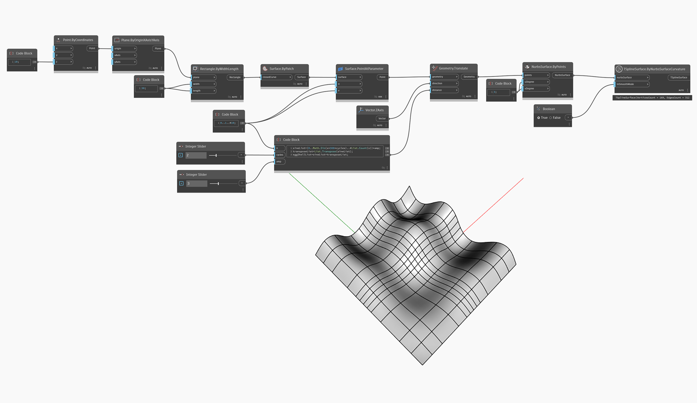

<!--- Autodesk.DesignScript.Geometry.TSpline.TSplineSurface.ByNurbsSurfaceCurvature --->
<!--- GO6D5UXWAXIC6JMDUDLIKMABU2I4XHLVLAL77BROSGFAFN7455KA --->
## Podrobnosti
V níže uvedeném příkladu je povrch NURBS stupně 3 převeden na povrch T-Spline pomocí uzlu `TSplineSurface.ByNurbsSurfaceCurvature`. Počet a pozice rozpětí povrchu T-Spline jsou automaticky detekovány podle zakřivení.

## Vzorový soubor

