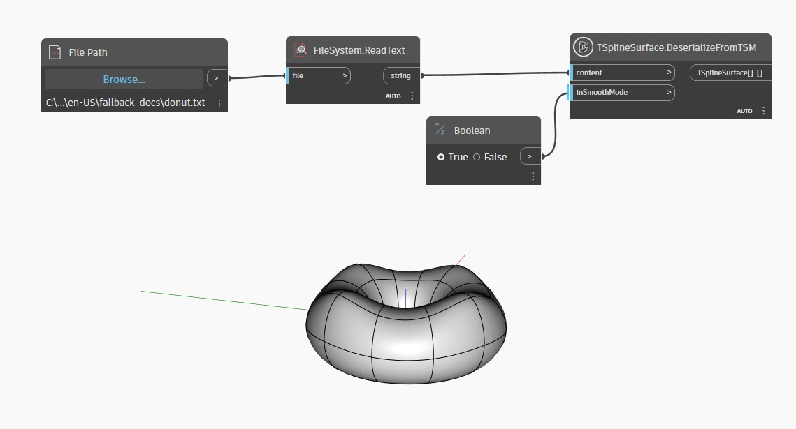

<!--- Autodesk.DesignScript.Geometry.TSpline.TSplineSurface.DeserializeFromTSM --->
<!--- HBD752E5KQ2LBVQYS575OP546LHHTXJCD4I2NUKGZV4QDHJLBMMQ --->
## Podrobnosti

V níže uvedeném příkladu je povrch T-Spline rekonstruován z formátu TSM pomocí uzlu `TSplineSurface.DeserializeFromTSM`. Textový soubor byl dříve vytvořen pomocí uzlu `TSplineSurface.SerializeAsTSM`.
___
## Vzorový soubor

