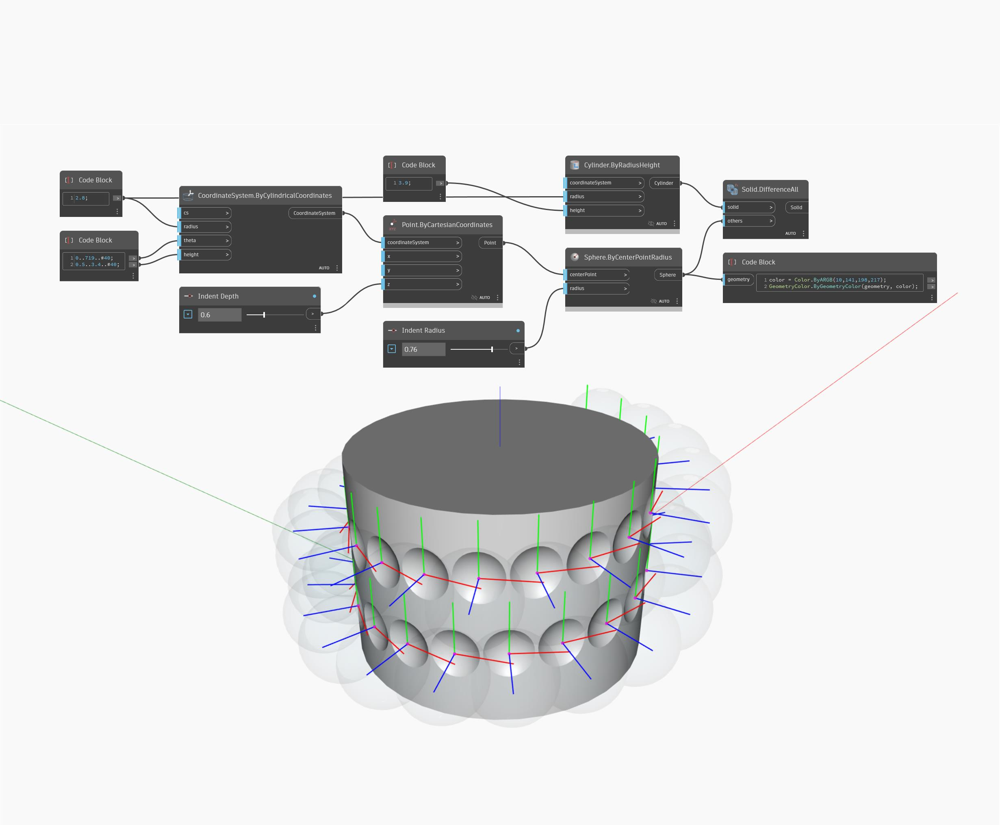

<!--- Autodesk.DesignScript.Geometry.CoordinateSystem.ByCylindricalCoordinates --->
<!--- HJVNQTWA5OIN3IEMTVCDNHS4EDEZD7QGICLE5I7LFBSR5XR6NZXQ --->
## Podrobnosti
Uzel Point By Cylindrical Coordinates vytvoří bod umístěný uvnitř válcového prostoru. Zde nastavíme vázání na křížový odkaz a pomocí rozsahu úhlů a výšek vygenerujeme osnovu bodů podél válce s dynamickým poloměrem.
___
## Vzorový soubor

