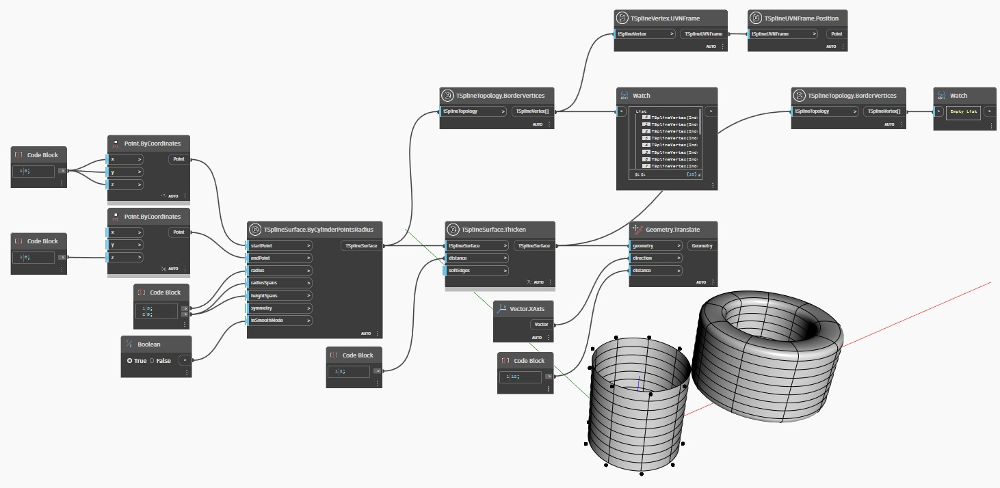

<!--- Autodesk.DesignScript.Geometry.TSpline.TSplineTopology.BorderVertices --->
<!--- HQ6POKIVNCM33NLZR7L63JAH22EKXEGGTWB4ZJMFEMLFXZYJDPHQ --->
## Podrobnosti
Uzel `TSplineTopology.BorderVertices` vrací seznam okrajových vrcholů obsažených v povrchu T-Spline.

V níže uvedeném příkladu jsou dva povrchy T-Spline vytvořeny pomocí uzlu `TSplineSurface.ByCylinderPointsRadius`. Jeden je otevřený povrch, zatímco druhý je zesílen pomocí uzlu `TSplineSurface.Thicken`, což jej změní na uzavřený povrch. Jakmile jsou oba povrchy prozkoumány pomocí uzlu `TSplineTopology.BorderVertices`, první vrací seznam okrajových vrcholů, zatímco druhý vrací prázdný seznam. To proto, že vzhledem k tomu, že je povrch uzavřený, neexistují žádné okrajové vrcholy.
___
## Vzorový soubor

